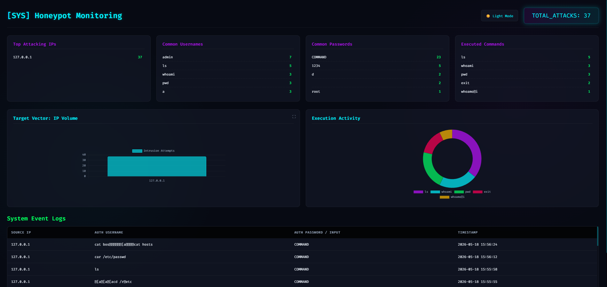
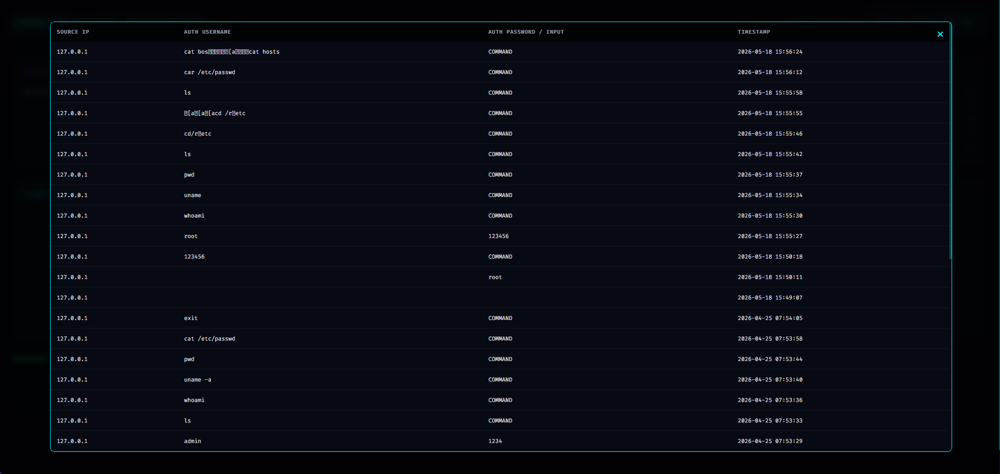

# Honeypot Project

A lightweight Python-based SSH Honeypot and Flask Dashboard for tracking unauthorized login attempts and malicious commands.

## Overview
This project simulates an SSH server to lure attackers and logs their IP addresses, usernames, passwords, and the commands they attempt to execute. The data is stored in a local SQLite database and visualized on a dynamic, modern web dashboard.

## Features
- **Fake SSH Server**: Listens on port 2222 and simulates an Ubuntu environment.
- **Credential Logging**: Captures brute-force attempts and passwords.
- **Command Tracking**: Records all commands entered by attackers in the fake bash shell.
- **Analytics Dashboard**: A Flask-based web UI that provides real-time statistics, attack volume graphs, and top attacker IPs.

## Dashboard Previews
*(Once you take screenshots of your dashboard, save them in an `assets` folder and uncomment the lines below)*

<!-- 

 
-->

## Setup Instructions

### 1. Requirements
Ensure you have Python 3 installed.

### 2. Run the Honeypot Server
Activate the virtual environment and start the server:
```powershell
.\honeypot-venv\Scripts\activate
python server.py
```
*The honeypot will start listening on port 2222.*

### 3. Run the Dashboard
In a new terminal window, activate the virtual environment and start the dashboard:
```powershell
.\honeypot-venv\Scripts\activate
python dashboard.py
```
*Access the dashboard at `http://127.0.0.1:5000`.*

## Testing Locally
You can test the honeypot by connecting to it via a raw TCP connection (do not use a standard SSH client as this uses a fake protocol banner):
```powershell
curl telnet://127.0.0.1:2222
```
Login with any credentials and try running commands like `whoami`, `ls`, or `cat /etc/passwd`.
